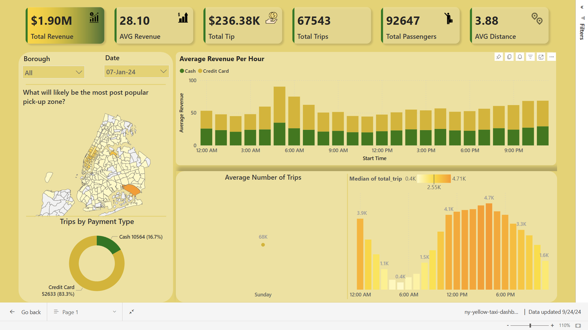
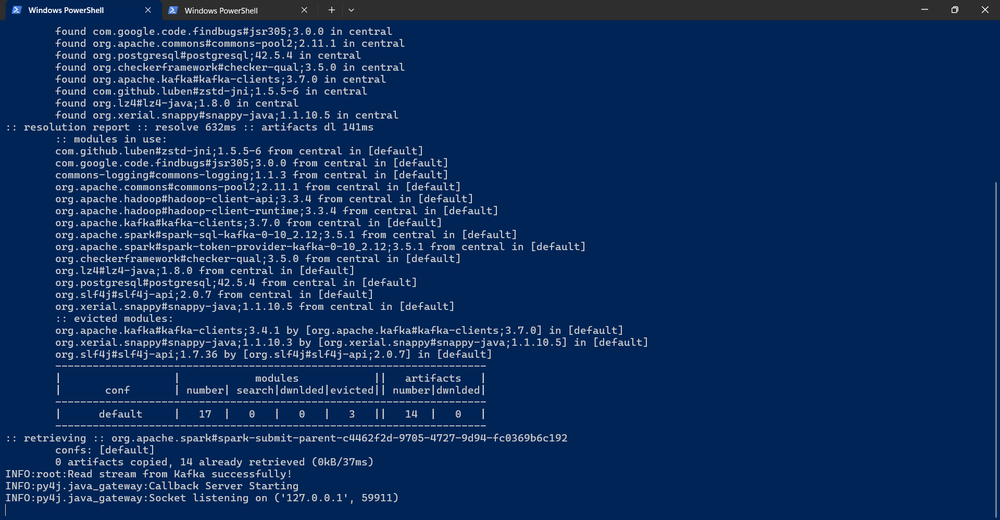

# 🚕 New York City Yellow Trip Stream Processing
This reference architecture shows an **end-to-end real-time analytics pipeline** utilizing ETL(Extract, Transform, Load) processes. The pipeline will ingest data from a source, perform necessary transformations and computations, and load it into storage for future purposes.

**Scenario**: A taxi company that has collected yellow taxi trip data in New York City. The dataset includes several fields such as total_amount, dropoff_location, pickup_location, and trip_distance. There is also a lookup file containing boroughs and zones based on location_id. To analyze trip trends in real-time, the company aims to calculate the number of trips, average revenue per hour,... and detect abnormal trips as early as possible.


## Overview
Let's break down the data pipeline process step-by-step:
1. **Data Streaming**: Initially, data is streamed from the file into a Kafka topic
2. **Data Processing**: A Spark job then takes over, consuming the data from the Kafka topic, transforming, analyzing and transferring it to a PostgreSQL database
3. **Data Visualizing**: A dynamic dashboard for real-time and day-to-day analysis has been built using Power BI.

Kafka will be configured using Docker, specifically with docker-compose, to run alongside the Kafka UI service, which provides a user interface for easier visualization and monitoring.

### Tools: 

## Achievements
- Detects abnormal trip durations (e.g., less than 1 minute, more than 2 hours) and identifies discrepancies between the actual and calculated amounts.
- Calculated average revenue and trip counts per hour, categorized by payment type and borough.
- Configures Spark session with optimized parameters, including custom shuffle partitions and broadcast joins for efficient processing.
- A dynamic dashboard for monitoring and analyzing trends each day.
- Efficiently writes large-scale processed streaming data to PostgreSQL in near real-time.
<p align="center">
    

## 📕  Table Of Contents
* [⚙️ Local Setup](https://github.com/LNYN-1508/Data-Pipeline-Project/blob/main/README.md#%EF%B8%8F-local-setup)
* [💻 Deployment](https://github.com/LNYN-1508/Data-Pipeline-Project/blob/main/README.md#-deployment)
    - [Postgres Setup](https://github.com/LNYN-1508/Data-Pipeline-Project/blob/main/README.md#postgres-setup)
    - [Kafka Setup](https://github.com/LNYN-1508/Data-Pipeline-Project/blob/main/README.md#kafka-streaming)
    - [Spark Setup](#spark-setup)
* [Summary](#summary)

The sequence to run the script is: `create_table.py` -> `spark_streaming.py` -> `kafka_stream.py`

## ⚙️ Local Setup
        
### 📂 Dataset
The company has shared with you 3 key datasets for this data.

<details>
<summary>
🚕 New York Yellow Taxi Dataset
</summary>

**This data will be primarily used for the processes of collection, transformation, and loading.**

**The data file is too large to push it to github. Therefore, please press below to download the zip file and extract it to the `data/` folder of the project directory. Otherwise, you can place it anywhere you want.**
- [yellow_tripdata_2024.csv](https://drive.google.com/file/d/1mT3UTHNjPHGxKTQLuipTNqGLAsXInG9R/view)

| Field                | Description                                                                                                            |
|----------------------|------------------------------------------------------------------------------------------------------------------------|
| VendorID             | A code indicating the TPEP provider that provided the record. 1= Creative Mobile Technologies, LLC; 2= VeriFone Inc.    |
| tpep_pickup_datetime  | The date and time when the meter was engaged.                                                                         |
| tpep_dropoff_datetime | The date and time when the meter was disengaged.                                                                      |
| Passenger_count       | The number of passengers in the vehicle. This is a driver-entered value.                                              |
| Trip_distance         | The elapsed trip distance in miles reported by the taximeter.                                                         |
| PULocationID          | TLC Taxi Zone in which the taximeter was engaged.                                                                     |
| DOLocationID          | TLC Taxi Zone in which the taximeter was disengaged.                                                                  |
| RateCodeID            | The final rate code in effect at the end of the trip. <br>1= Standard rate <br>2= JFK <br>3= Newark <br>4= Nassau or Westchester <br>5= Negotiated fare <br>6= Group ride |
| Store_and_fwd_flag    | Indicates whether the trip record was held in vehicle memory before sending to the vendor due to no server connection. <br>Y = Store and forward trip <br>N = Not a store and forward trip |
| Payment_type          | A numeric code signifying how the passenger paid for the trip. <br>1= Credit card <br>2= Cash <br>3= No charge <br>4= Dispute <br>5= Unknown <br>6= Voided trip |
| Fare_amount           | The time-and-distance fare calculated by the meter.                                                                  |
| Extra                 | Miscellaneous extras and surcharges, including $0.50 and $1 rush hour and overnight charges.                          |
| MTA_tax               | $0.50 MTA tax automatically triggered based on the metered rate in use.                                               |
| Improvement_surcharge | $0.30 improvement surcharge assessed at flag drop. This began in 2015.                                                |
| Tip_amount            | Tip amount. Automatically populated for credit card tips; cash tips are not included.                                 |
| Tolls_amount          | Total amount of all tolls paid in trip.                                                                               |
| Total_amount          | The total amount charged to passengers. Does not include cash tips.                                                   |
| Congestion_Surcharge  | Total amount collected in trip for NYS congestion surcharge.                                                          |
| Airport_fee           | $1.25 for pick up only at LaGuardia and John F. Kennedy Airports.                                                     |


</details>

<details>
<summary>
🔍 Taxi Zone Lookup Table
</summary>

**This data is used to support the development of dashboard analyses in Power BI.**
- [taxi_zone_lookup.csv](https://github.com)

| Field         | Description                                                                                       |
|---------------|---------------------------------------------------------------------------------------------------|
| LocationID    | A unique identifier assigned to each specific location within the NYC Taxi Zone system.            |
| Borough       | The NYC borough (e.g., Manhattan, Brooklyn, Queens, The Bronx, Staten Island) where the location is.|
| Zone          | The designated geographic area or neighborhood within the borough associated with the LocationID.  |
| Service Zone  | The type of service zone, indicating whether the area is an Airport, Yellow Taxi Zone, or Boro Taxi Zone. |

</details>

<details>
<summary>
🗺️ Taxi Zone Shapefile
</summary>

**This data is used to support the development of dashboard analyses in Power BI.**
- [taxi_zone_shapefile](https://github.com)

</details>

### Prerequisites
- Install [Docker](https://www.docker.com/products/docker-desktop/) for running Kafka
- Install [JDK](https://www.oracle.com/java/technologies/downloads/?er=221886)
- Install [Spark](https://spark.apache.org/downloads.html)
- Install [Python](https://www.python.org/)
- Install [PostgreSQL](https://www.postgresql.org/download/)

**Attention: Apache Spark is only compatible with Java 8, Java 11, or Java 17.**

1. You can clone, fork, or download this GitHub repository on your local machine using the following command:
** **
        git clone https://github.com/LNYN-1508/Data-Pipeline-Project-1.git

**Here is the overall structure of the project:**
** ** 
    Root Directory
    │
    ├── data
    │   ├── yellow_tripdata_2024.csv
    │   ├── taxi_zone_lookup.csv
    │   ├── taxi_zone_shapefile
    │   └── index.txt
    │
    ├── config
    │   └── config.ini
    │
    ├── src
    │   ├── create_table.py
    │   ├── kafka_stream.py
    │   └── spark_streaming.py
    │
    ├── tmp
    │   ├── sql_warehouse
    │   ├── local_dir
    │   └── checkpoint
    │       ├── abnormal_duration
    │       ├── abnormal_fee
    │       ├── avg_duration
    │       ├── avg_revenue
    │       ├── raw_data
    │       └── trip_count
    │
    └── docker-compose.yaml


- The ``config`` directory contains a ``config.ini`` file that includes the configuration of your PostgreSQL database and ``requirements.txt`` includes all the essential packages 
** **
    [database]
    host=localhost
    port=5432
    user=postgres
    password=enter_your_pwd
    database=enter_your_db

- The `data` directory contains `yellow_tripdata_2024.csv`, `taxi_zone_lookup.csv`, and the `shapefile` needed for the project. I'll explain the `index.txt` file later.
- The `tmp` directory holds the checkpoint locations for Spark jobs, which are essential for resuming Spark applications. It also includes `local_dir` and `sql_warehouse` for cleanup after running jobs. 
- The `src` directory has all the Python scripts: `create_table.py` for creating PostgreSQL tables, `kafka_stream.py` for sending data to Kafka, and `spark_streaming.py` for running Spark jobs.
- The `docker-compose.yaml` file configures Kafka services.

To set up your local development environment, start by creating a virtualenv environment, and installing the packages listed in `requirements.txt`
1. Create a virtualenv environment
`` python -m venv venv ``
2. Activate the venv environment 
- Window Powershell: `` venv/Scripts/Activate ``
- Linux: `` source venv/bin/activate `` 
3. Run `` pip install -r requirements.txt ``

And now you are good to go!!


## 💻 Deployment
### **```Postgres Setup```**
Before setting-up our spark and airflow configurations, let’s create the Postgres database that will persist our data. I prefer using the **pgAdmin 4** tool for this, however any other Postgres development platform can do the job.

When installing postgres, you need to setup a password that we will need later to connect to the database from the Spark environment. **You must remember the password to reconnect to the database servers**. You can also leave the port at 5432. If your installation has succeeded, you can start pgadmin and you should observe something like this window:
<p align="center">
  

Since we have many columns for the table we want to create, we opted to use a script with **psycopg2**, a PostgreSQL database adapter for Python, to create the table and add its columns. And we have installed the **psycopg2-binary** package in the `requirements.txt`

You can run the Python script with the following command:
** ** 
        python src/create_table.py

I use `config.ini` to access the database configurations, allowing you to modify the application settings easily. Alternatively, if you prefer to use a different method, you can make slight adjustments to the script accordingly. The `config.ini` file looks as follow:
** **
    [database]
    host=localhost #if you run Postgres in Docker, you need to use the Docker host
    port=5432
    user=postgres
    password=enter_your_pwd
    database=enter_your_db


### **```Kafka Setup```**
To avoid resending messages that have already been processed each time we run the streaming task, we define an `index.txt` file that records the number of messages sent in the latest streaming session. We use this number as the starting index for our new streaming task.

For example, if the latest streaming task has sent 1000 messages. This number, 1000, is also used as the starting index for the next streaming task because, although we sent 1000 messages, indexing starts from 0 in CSV file, which means the last message sent is at index 999. 

The file is saved in `/data/index.txt` and by default, the file is empty which means that our first streaming task will process the first message also at index 0.

**!!Note** that in a production setting, this approach of writing the number of the last processed message and storing it in a local file is not practical and not advisable. There are many other methods available to achieve this more effectively.

The code for Kafka streaming task can be found on `src/kafak_stream.py` and it primarily involves extracting data from a CSV file, serving the data to a Kafka topic using a Kafka producer, and updating the numbers in `index.txt`.

The next step is to run the Kafka service defined in the `docker-compose.yaml` file:
** ** 
    version: '3'

    services:
    kafka:
        container_name: kafka
        image: 'bitnami/kafka:latest'
        ports:
        - '9094:9094'
        networks:
        - airflow-kafka
        environment:
        - KAFKA_CFG_NODE_ID=0
        - KAFKA_CFG_PROCESS_ROLES=controller,broker
        - KAFKA_CFG_LISTENERS=PLAINTEXT://:9092,CONTROLLER://:9093,EXTERNAL://:9094
        - KAFKA_CFG_ADVERTISED_LISTENERS=PLAINTEXT://kafka:9092,EXTERNAL://localhost:9094
        - KAFKA_CFG_LISTENER_SECURITY_PROTOCOL_MAP=CONTROLLER:PLAINTEXT,EXTERNAL:PLAINTEXT,PLAINTEXT:PLAINTEXT
        - KAFKA_CFG_CONTROLLER_QUORUM_VOTERS=0@kafka:9093
        - KAFKA_CFG_CONTROLLER_LISTENER_NAMES=CONTROLLER
        volumes:
        - ./kafka:/bitnami/kafka

    kafka-ui:
        container_name: kafka-ui-1
        image: provectuslabs/kafka-ui:latest
        ports:
        - 8000:8080
        depends_on:
        - kafka
        environment:
        KAFKA_CLUSTERS_0_NAME: local
        KAFKA_CLUSTERS_0_BOOTSTRAPSERVERS: PLAINTEXT://kafka:9092
        DYNAMIC_CONFIG_ENABLED: 'true'

- We will use `bitnami/kafka` image for the Kafka service
- We set up the service with a single broker, which is sufficient for our small project. A Kafka broker handles the reception of messages from producers (the data sources), stores these messages, and distributes them to consumers (the data sinks or end-users). The broker listens on port 9092 for internal communication within the cluster and on port 9094 for external communication, enabling clients outside the Docker network to connect to the Kafka broker. 
- In the volumes section, we link the local directory `./kafka` to the Docker container directory `/bitnami/kafka` to ensure data persistence and allow for potential inspection of Kafka’s data from the host system.
- We configure the kafka-ui service using the Docker image `provectuslabs/kafka-ui:latest`. This offers a user interface to interact with the Kafka cluster, making it particularly beneficial for monitoring and managing Kafka topics and messages.

Now start to run our Kafka service:
** **
        docker-compose up -d

After the services start, visit the kafka-ui at http://localhost:8800/. Normally you should get something like this:
<p align="center">
  

Let's create a topic to contain the messages. Click on the **Topics** on the left and then **Create a topic**. Our topic will be called **yellow_tripdata** and since we just have a single broker we set the **replication factor** to **1**. We will set the **partitions** number to **10** (I will tell you the reason why later). Finally, we can set the time to retain data to a small number

**And please wait a little bit. We will run the Kafka script after running the Spark script.**

### **```Spark Setup```**
The goal of the Spark jobs is to consume the streaming data from Kafka topic **yellow_tripdata** and then transfere to the Postgres tables

The complete code for the Spark jobs is in the `src/spark_streaming.py` file

1. First we create the Spark Session
** ** 
    def create_sparksession() -> SparkSession:
        spark = SparkSession.builder \
                .appName("KafkaToPostgres") \
                .config("spark.sql.shuffle.partitions", "9") \
                .config("spark.sql.warehouse.dir", "tmp/sql_warehouse") \
                .config("spark.local.dir", "tmp/local_dir") \
                .getOrCreate()
        
        return spark

2.  The `read_kafka_stream`function ingests streaming data from the Kafka topic using Spark Structured Streaming.
** ** 
    # Apply schema to the data stream
    def create_schema(streaming_df):
        """ Modify the data schema of streaming data """

        schema = StructType([
            StructField('VendorID', StringType(), True),
            StructField('tpep_pickup_datetime', StringType(), True),
            StructField('tpep_dropoff_datetime', StringType(), True),
            StructField('passenger_count', StringType(), True),
            StructField('trip_distance', StringType(), True),
            StructField('RatecodeID', StringType(), True),
            StructField('store_and_fwd_flag', StringType(), True),
            StructField('PULocationID', StringType(), True),
            StructField('DOLocationID', StringType(), True),
            StructField('payment_type', StringType(), True),
            StructField('fare_amount', StringType(), True),
            StructField('extra', StringType(), True),
            StructField('mta_tax', StringType(), True),
            StructField('tip_amount', StringType(), True),
            StructField('tolls_amount', StringType(), True),
            StructField('improvement_surcharge', StringType(), True),
            StructField('total_amount', StringType(), True),
            StructField('congestion_surcharge', StringType(), True),
            StructField('Airport_fee', StringType(), True)
        ])


        df = streaming_df.selectExpr("CAST(value AS String)")\
            .select(from_json(col('value'), schema).alias('data')) \
            .select('data.*')
        
        df_stream = df \
                .withColumnRenamed('VendorID', 'vendor_id') \
                .withColumnRenamed('tpep_pickup_datetime', 'pickup_datetime') \
                .withColumnRenamed('tpep_dropoff_datetime', 'dropoff_datetime') \
                .withColumnRenamed('RatecodeID', 'ratecode_id') \
                .withColumnRenamed('PULocationID', 'pu_location_id') \
                .withColumnRenamed('DOLocationID', 'do_location_id') \
                .withColumnRenamed('Airport_fee', 'airport_fee') \

        return df_stream

4. The `select_columns` function allows us to select only **the relevant columns** instead of processing the entire dataset repeatedly. Since we will be performing analysis on the streaming data, this helps reduce memory and CPU usage, improves performance by processing less data.
** ** 
    def select_columns(df_stream):
        streaming_main = df_stream.select(
            to_timestamp(col("pickup_datetime")).alias("pickup_datetime"),
            to_timestamp(col("dropoff_datetime")).alias("dropoff_datetime"),
            col("total_amount").cast("double").alias("total_amount"),
            col("payment_type").cast("int").alias("payment_type")
        )

        streaming_extra = df_stream.select(
        "pickup_datetime", "dropoff_datetime", "total_amount", "payment_type",
        "pu_location_id", "do_location_id", "fare_amount", "extra", "mta_tax", 
        "tip_amount", "tolls_amount", "improvement_surcharge", "airport_fee"
        )

        return streaming_main, streaming_extra

5. Data source JDBC does not support streamed writing. Therefore, if we want to write data to JDBC sink from the structured streaming, we need to use [foreachBatch](https://spark.apache.org/docs/latest/structured-streaming-programming-guide.html#using-foreach-and-foreachbatch).
** **
    def foreach_batch_function(df, epoch_id, table_name):
        jdbc_url = f"jdbc:postgresql://{HOST}:5432/{DB_NAME}"
        connection_properties = {
            "user": f"{USER}",
            "password": f"{PWD}",
            "driver": "org.postgresql.Driver"
        }

        df.write.jdbc(jdbc_url, table_name, mode="append", properties=connection_properties)

6. The `write_to_postgres` function is responsible for writing data to multiple tables, comprising **6** Spark jobs.
- The first job writes raw data to the **yellow_tripdata** table
- The second and third identifies trips with abnormal durations and fees and writes them to the **abnormal_duration** and **abnormal_fee** tables
- The fourth counts trips per hour and stores it in **trip_count** table
- The fifth calculates the average revenue per hour and stores it in **avg_revenue**
- The last one computes the trip count by borough and writes to **trip_count_by_borough** table

Now it's time to run the Spark jobs. Are you ready? Great!!!
- But first we need the PostgreSQL JDBC Driver Jar to connect to Postgres database, you can download the jar file [here](https://mvnrepository.com/artifact/org.postgresql/postgresql). Choose the version like `42.7.3` and you can see something like `jar (1.0 MB)`. Please download it!

Finally let's run the Spark jobs. We will run Spark master, and a single Spark worker.

We need **4** powershell for this project. 1 for Spark master, 1 for Spark worker, 1 for Kafka streaming task, and 1 for Spark jobs

I will show you how to run on both Window and Linux.

- Let's run Spark master first. Once started, the master prints out a `spark://HOST:PORT` URI. We use this when we start the worker node and submit the Spark jobs. You can find this URI on `localhost:8080`
** **
        $SPARK_HOME/bin/spark-class.cmd org.apache.spark.deploy.master.Master
        $SPARK_HOME/sbin/start-master.sh

- Next, we will start the worker with following command. Please change the **HOST** and **PORT** to yours
** ** 
        $SPARK_HOME/bin/spark-class.cmd org.apache.spark.deploy.worker.Worker spark://HOST:PORT
        $SPARK_HOME/sbin/start-slave.sh spark://HOST:PORT

- Go ahead and run the following command to submit the Spark jobs
** **
        $YOUR_PROJECT_DIRECTORY/spark-submit \
        --master spark://HOST:PORT \
        --num-executors 1 \
        --executor-memory 5G \
        --total-executor-cores 10 \
        --packages org.apache.spark:spark-sql-kafka-0-10_2.12:3.5.1,org.postgresql:postgresql:42.5.4,org apache.kafka:kafka-clients:3.7.0 \
        --driver-class-path /path-to-your-jar/postgresql-x.x.x.jar \
        spark_streaming.py

The reason why I only use **1 executor** is because I don't have many CPU and memory resources. If we have multiple executors, the cores and memory would need to be divided, and if the memory is too little, each core wouldn't have enough resources to complete its tasks. Ideally, each partition should have at least **250MB** of memory. In this situation, I need to use what's called a **fat executor**, which means using just 1 executor and allocating all the available cores and memory to it. With 10 cores, each core will have **500MB** of memory, meaning it can handle up to **500MB** of data.

Additionally, the reason I create **10 partitions** when setting up a Kafka topic is so that each of the **10 cores** can handle a separate partition. This helps to improve throughput and fully utilize the parallelism of Kafka and the distributed system of Spark.


If there are no errors, you will see something like this on the shell:
<p align="center">
    

The first time you run Spark, it will set up the necessary resources, and you'll see an output similar to the one above. And for the next time, we just see something like below. 
<p align="center">
    

**After successfully running the Spark jobs, we can run the Kafka script now.**
** **
        python src/kafka_stream.py

Now, you can access PostgreSQL to view the output tables. Try querying one of the tables to see the data.

## Summary
Throughout this guide, we’ve thoroughly examined each component of the pipeline, setting up Kafka for data streaming, from processing data with Spark to storing it in PostgreSQL. The incorporation of Docker simplifies the Kaffka setup.

It's important to note that while this setup is ideal for learning and small-scale projects, scaling it for production use would require additional considerations, particularly regarding security and performance optimization. Future enhancements could include integrating advanced data processing techniques,expanding the pipeline to incorporate more complex data sources.

